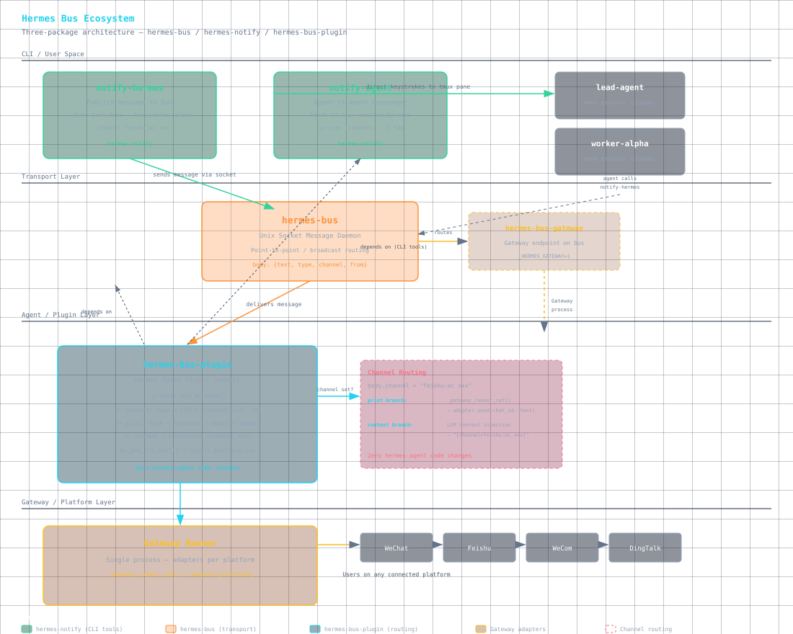

# hermes-bus-plugin

[English](./README.md) | [中文](./README.zh.md)

<p align="center"></p>

**Role in the Hermes messaging ecosystem:** hermes-bus-plugin is the **receive-side agent plugin** (Layer 3) — it consumes bus messages and routes them to terminal output, LLM context injection, or command execution. The other two packages are:

- [hermes-notify](https://github.com/mlinquan/hermes-notify) — **CLI senders** (Layer 1) that inject messages into the ecosystem
- [hermes-bus](https://github.com/mlinquan/hermes-bus) — **transport daemon** (Layer 2) that routes JSON messages between endpoints



Together: **notify → bus → plugin → Gateway adapters → users**. Zero hermes-agent code changes at the channel routing layer.

## Install

```bash
# Via Hermes plugin manager
hermes plugins install hermes-bus-plugin

# Or copy to ~/.hermes/hermes-agent/plugins/
cp -r hermes-bus-plugin ~/.hermes/hermes-agent/plugins/
hermes plugins enable hermes-bus-plugin
```

## Session Naming

Each CLI window registers a unique bus endpoint on startup. The default endpoint is `hermes-bus` (first session), with `hermes-bus-2`, `hermes-bus-3`, etc. for additional sessions. To give your session a stable name that survives reconnection:

```bash
/title my-agent-name
```

The plugin uses the title set by `/title` as the bus endpoint name.

| Action | When | Description |
|--------|------|-------------|
| Start bus daemon | Plugin load | Ensures hermes-bus is running |
| Register listener | Plugin load | Opens a bus endpoint for incoming messages |
| Print notifications | On bus message | `print: true` → terminal (only when context is NOT true) |
| Inject context + push | On bus message | `context: true` → dual-mode LLM trigger: **Gateway** — gw-trigger creates synthetic `MessageEvent` → `adapter.handle_message` → full agent pipeline → LLM response pushed to chat platform via adapter. **CLI** — `_interrupt_queue` / `_pending_input` pushes to agent terminal. In both modes, context injection is skipped when the trigger fires to avoid double processing (**overrides print**, token-heavy — use sparingly) |
| Execute command | On bus message | `command` → async subprocess (audio, scripts, etc.) — runs inside Hermes process, no external daemon needed |

## Provided Tools

**bus_send** — send a message through the bus to any endpoint:
```
bus_send(target="notifier", type="progress", text="50% done")
```

**bus_status** — check bus health and connected endpoints:
```
bus_status()
```

**bus_info** — show current session's bus connection details:
```
bus_info()
```

## Route Rules

Messages arriving at the bus are matched against `~/.hermes/bus-rules.yaml` rules.
Each rule can trigger three independent actions:

| Field | Behavior | Default |
|-------|----------|---------|
| `print` | Print to terminal | `false` |
| `print_format` | Template or script for terminal output | `{text}` |
| `context` | Inject into LLM context + push to Agent | `false` |
| `context_format` | Template or script for context/push text | `{text}` |
| `command` | Execute shell command (audio, script, etc.) | none |

### Priority Logic

`context` and `print` are mutually exclusive:
- `context: true` → inject context + push to Agent (**print is ignored**). ⚠️ Token-heavy — each push triggers an Agent turn.
- `print: true` → terminal output only (only when context is NOT true)
- `command` → always executed if defined, independent of context/print

### Format Templates

`print_format` and `context_format` support these placeholders:

| Placeholder | Description |
|-------------|-------------|
| `{from}` | Sender endpoint name |
| `{text}` | Message body text |
| `{type}` | Message type |
| `{ts}` | Unix timestamp (raw) |
| `{ts:%Y-%m-%d %H:%M:%S}` | strftime formatted |
| `{color:cyan}` | ANSI foreground color (black/red/green/yellow/blue/magenta/cyan/white) |
| `{color:bold_green}` | Bold color variant |
| `{bold}` | Bold text |
| `{reset}` | Reset all styles |

### Script Support

If `print_format` or `context_format` starts with `~` or `/` and points to an executable file, the script is run with `FROM`, `TYPE`, `TEXT` as environment variables and its stdout is used as the rendered output (supports ANSI colors).

```bash
#!/bin/bash
# format-notify.sh — example format script
GREEN="\033[1;32m"
YELLOW="\033[1;33m"
RESET="\033[0m"

case "$TYPE" in
  task_done)  echo -e "${GREEN}✔ ${FROM}${RESET} — ${TEXT}" ;;
  task_error) echo -e "${YELLOW}✖ ${FROM} failed${RESET}\n   ${TEXT}" ;;
  *)          echo -e "${FROM}: ${TEXT}" ;;
esac
```

```yaml
# bus-rules.yaml
- match_type: task_done
  print: true
  print_format: "~/scripts/format-notify.sh"
```

### Example Rules

```yaml
callbacks:
  # Notification only (no context)
  - match_type: ack
    print: true
    print_format: "{color:cyan}📬 {from}{reset}  {text}  [{ts:%H:%M}]"
    context: false

  # Silent context injection
  - match_type: progress
    print: false
    context: true

  # Context + terminal + audio
  - match_type: task_done
    print: true
    print_format: "{color:bold_green}✔ {from}{reset} → {text}  {color:cyan}[{ts:%H:%M:%S}]{reset}"
    context: true
    command: "afplay ~/sounds/done.mp3"
```

## Notification Protocol

This section documents the complete end-to-end notification protocol — how agents send messages, how the bus routes them, and how cross-agent communication works. **Zero changes to hermes-agent code are required.**

### 1. `notify-agent` — Send to a CLI Session

Sends a message directly to a tmux session. Used for inter-agent communication within the same machine.

The first argument is the **tmux session name**, not an agent name or bus endpoint. You create sessions with `tmux new-session -s <name>`. The `notify-agent` tool sends keystrokes to the target session's active pane.

```bash
# Start two agent sessions
tmux new-session -d -s lead-agent   'claude'
tmux new-session -d -s worker-alpha 'claude'

# Send a message to the lead agent
notify-agent lead-agent "Task queue is empty, ready for next assignment"

# Send with explicit sender name
notify-agent --from worker-alpha lead-agent "Build complete, 3 tests passing"
```

| Argument | Required | Description |
|----------|----------|-------------|
| `<session>` | yes | Target tmux session name — the name passed to `tmux new-session -s` |
| `--from` | no | Sender display name (e.g. `worker-alpha`). Auto-detected from session name if omitted |
| `"message"` | yes | Plain text message (positional, last argument) |

**Important:** `notify-agent` sends text to a tmux pane directly. It does NOT go through the bus. The target must be a running tmux session. Use `notify-hermes` for bus-routed messages.

### 2. `notify-hermes` — Send Through the Bus

Sends a message through the `hermes-bus` daemon. The bus delivers it to all registered endpoints. `bus-rules.yaml` callbacks control how each endpoint processes the message (print to terminal, inject into LLM context, execute a command).

```bash
# Format
notify-hermes --to <endpoint> [options] "message text"
# Or with full JSON body
notify-hermes --to <endpoint> --body '{"text":"hello","key":"value"}'

# Examples
notify-hermes --to hermes-bus --type ack "Acknowledged, starting work"
notify-hermes --to hermes-bus --type task_done "All tasks complete"
notify-hermes --to hermes-bus --type task_error --channel wecom_ops "Production outage, manual intervention needed"
```

#### Message body (constructed from CLI args)

| Argument | Body field | Default | Description |
|----------|-----------|---------|-------------|
| `"message"` | `text` | — | Plain text (positional, mutually exclusive with `--body`) |
| `--body` | *(raw JSON)* | — | Full JSON body dict (mutually exclusive with positional message) |
| `--type` | `type` | none | Message type: `ack`, `task_start`, `progress`, `task_done`, `plan_ready`, `task_error`, `need_decision`, `directive` |
| `--channel` | `channel` | none | Reply routing token (see Channel Protocol below) |
| `--from` | `from_ep` | auto-detected | Override sender name (auto-detected from tmux session via `role_map`) |
| `--to` | *(routing)* | required | Target bus endpoint name |

#### `--type` values and their behavior

> The values below are common conventions — `--type` accepts any string, `bus-rules.yaml` matches them exactly.

| `--type` | Meaning | Typical `context` | Typical `print` | Voice |
|----------|---------|-------------------|-----------------|-------|
| `directive` | Task assignment (coordinator → worker) | true | false | no |
| `ack` | Acknowledgement ("received, working") | false | true | no |
| `task_start` | Task started | true | false | no |
| `progress` | Intermediate progress update | true | false | no |
| `task_done` | Task completed | true | true | yes |
| `plan_ready` | Plan ready for review | true | true | yes |
| `task_error` | Error / escalation | true | true | yes |
| `need_decision` | Decision needed | true | true | yes |

### 3. `--channel` Protocol — Reply Routing

The `--channel` parameter enables reply routing across chat platforms. It flows through the entire notification chain and allows the system to reply back to the original conversation.

#### Format

```
<platform>:<chat_id>
```

| Value | Resolves to |
|-------|-------------|
| `weixin` | WeChat, specific chat |
| `feishu:oc_abc123` | Feishu, specific chat `oc_abc123` |
| `wecom:ww456` | WeCom, specific chat `ww456` |
| `dingtalk:cid789` | DingTalk, specific chat `cid789` |
| `feishu` | Feishu, fallback to `FEISHU_HOME_CHANNEL` env var |
| `wecom` | WeCom, fallback to `WECOM_HOME_CHANNEL` env var |
| `weixin` | WeChat, fallback to `WEIXIN_HOME_CHANNEL` env var |
| `dingtalk` | DingTalk, fallback to `DINGTALK_HOME_CHANNEL` env var |

#### Resolution logic

1. Split `channel` on first `:`
2. If `chat_id` present → use directly
3. If `chat_id` absent → resolve from `*_HOME_CHANNEL` environment variable (set by Gateway platform adapters)
4. Map `platform` to the live Gateway adapter via `GatewayRunner.adapters`
5. Call `adapter.send(chat_id, content)` — async, bridged via `asyncio.run_coroutine_threadsafe`

#### Channel pass-through

When the bus-plugin receives a message with `channel` set, the channel token is preserved through the entire chain:

```
incoming body.channel = "feishu:oc_abc123"
  → agent sees the channel in context
  → agent includes --channel feishu:oc_abc123 in its notify-hermes calls
  → bus-plugin forwards reply to feishu adapter
  → user sees response in the original chat
```

The `channel` field is **an opaque routing token**. It is never interpreted or modified by agents — they simply echo it back. Only the bus-plugin (at the final delivery point) acts on it.

### 4. Bus-Plugin Receive-Side Routing

When `hermes-bus` delivers a message to the plugin's registered endpoint, `_process_bus_message()` dispatches it based on `bus-rules.yaml` callbacks:

```
Bus message arrives
  │
  ├─ match_type → callback rule
  │
  ├─ context: true
  │   └─ Render context_format → queue for on_pre_llm_call() injection
  │      → If body.channel is set: Gateway immediate LLM trigger
  │         (synthetic MessageEvent → _handle_message → agent pipeline
  │          → LLM response pushed to chat platform via adapter.send)
  │      ⚠️ print is IGNORED when context is true
  │
  ├─ print: true (context is false, OR runs alongside context)
  │   └─ Render print_format → terminal output (ANSI via prompt_toolkit)
  │      → If body.channel is set: try Gateway adapter.send() first
  │         (asyncio.run_coroutine_threadsafe from listen_bus thread)
  │      → Fallback: _cprint() to terminal
  │
  └─ command (always executed if defined)
      └─ subprocess.Popen(shell=True)
         Env vars: MESSAGE (full JSON), TYPE, FROM, CHANNEL, TEXT, TS
         → Example: play-notify-sound
```

#### Env vars available to command scripts

| Env var | Content |
|---------|---------|
| `MESSAGE` | Full bus message as JSON string |
| `TYPE` | Message type (e.g. `task_done`) |
| `FROM` | Sender endpoint name |
| `CHANNEL` | Channel string if `--channel` was used (empty otherwise) |
| `TEXT` | Message body text |
| `TS` | Unix timestamp |

### 5. AI Agent Notification Lifecycle

The complete lifecycle for agent-to-agent communication via the bus:

```
User message arrives (e.g., via Feishu → Gateway → Agent)
  │  body.channel = "feishu:oc_abc123"  ← Gateway sets this
  ▼
Agent processes message, reports progress to lead agent via bus
  │  notify-hermes --to lead-agent --type progress "Phase 1 done" --channel feishu:oc_abc123
  │  └─ channel preserved from incoming message
  ▼
Bus routes to lead-agent endpoint
  │  bus-rules.yaml matches type=progress → context=true (silent injection)
  ▼
Lead agent's LLM sees context, decides to dispatch a worker
  │  Agent calls notify-hermes --to worker-beta --type directive "run task X" --channel feishu:oc_abc123
  │  └─ channel forwarded to worker
  ▼
Worker agent receives directive via bus, starts work
  │  Worker completes, reports back:
  │  notify-hermes --to lead-agent --type task_done "X complete" --channel feishu:oc_abc123
  ▼
Bus routes task_done → lead-agent endpoint
  │  bus-rules.yaml: print=true + context=true + command=play-notify-sound
  │  context branch → channel=feishu:oc_abc123 → gw-trigger → _handle_message
  │  → agent pipeline → LLM response → adapter.send() to Feishu
  ▼
Original user receives LLM-processed reply in Feishu: "X complete"
```

**Key principle:** `channel` is an opaque routing token. Agents pass it through without interpreting it. The bus-plugin handles final delivery. Agent reasoning stays simple — echo the channel you received.

### 6. Complete End-to-End Example

A concrete walkthrough using three tmux sessions (`lead-agent`, `worker-alpha`, `worker-beta`) and the bus.

#### Setup

```bash
# Start three agent sessions
tmux new-session -d -s lead-agent   'claude'
tmux new-session -d -s worker-alpha 'claude'
tmux new-session -d -s worker-beta  'claude'
```

#### Flow

```
── 1. Coordinator dispatches ──────────────────────────────────────
   A user request arrives via Gateway (channel = "feishu:oc_abc123").
   lead-agent's LLM decides: "worker-alpha should handle this."

   Agent calls:
   notify-hermes --to worker-alpha --type directive \
     --channel feishu:oc_abc123 \
     "Refactor auth middleware — extract token validation into a shared module"

   → Bus routes to worker-alpha endpoint
   → bus-rules.yaml: directive → context=true (silent injection)
   → worker-alpha's Agent sees: "[directive] lead-agent: Refactor auth middleware..."
   → channel=feishu:oc_abc123 carried through

── 2. Worker acknowledges ─────────────────────────────────────────
   notify-hermes --to lead-agent --type ack \
     --channel feishu:oc_abc123 \
     "Received, starting auth middleware refactor"

── 3. Worker reports progress ─────────────────────────────────────
   notify-hermes --to lead-agent --type progress \
     --channel feishu:oc_abc123 \
     "Token validation extracted, 3 of 5 endpoints migrated"

   → lead-agent sees: "worker-alpha progress: Token validation extracted..."

── 4. Worker completes ────────────────────────────────────────────
   notify-hermes --to lead-agent --type task_done \
     --channel feishu:oc_abc123 \
     "Auth middleware refactor complete. 5/5 endpoints migrated, all tests pass"

   → Bus routes task_done → lead-agent endpoint
   → bus-rules.yaml: print=true + context=true + command
   → Terminal: "worker-alpha completed: Auth middleware refactor complete..."
   → command: play-notify-sound (audio cue)
   → context: gw-trigger → _handle_message → agent pipeline
     → LLM response pushed to Feishu via adapter.send()
   → User sees in Feishu: LLM-processed completion summary

── 5. Status check via bus (zero I/O) ─────────────────────────────
   notify-hermes --to worker-alpha --type ack "Status check: still alive?"
   # worker-alpha responds within 30s per protocol
```

### Channel Lifecycle Summary

```
Gateway sets channel ──→ Agent echoes channel ──→ Bus carries channel
(incoming platform msg)  (in all notify-hermes)   (in message body)

Bus-plugin receives ──→ gw-trigger (context) or _send_via_gateway_runner (print)
(body.channel preserved)  → adapter.send() (reply to user)
```

**The channel token never changes.** Every agent passes it through unmodified. Only the bus-plugin (at final delivery) acts on it.

### 7. DingTalk OpenAPI Fallback

DingTalk Stream mode provides per-message `session_webhook` URLs for outbound delivery. When no recent inbound message exists in the current Gateway session (group chats without prior @mention, or Gateway restart), the webhook is unavailable and `adapter.send()` fails silently.

The bus-plugin's `_send_via_gateway_runner` and gw-trigger both fall back to the DingTalk OpenAPI `batchSend` endpoint when the adapter path fails:

```
adapter.send() fails (no session_webhook)
  → POST https://api.dingtalk.com/v1.0/oauth2/accessToken
    (appKey=DINGTALK_CLIENT_ID, appSecret=DINGTALK_CLIENT_SECRET)
  → POST https://api.dingtalk.com/v1.0/robot/oToMessages/batchSend
    (openConversationId=chat_id, msgKey=sampleMarkdown)
```

Zero additional SDK dependencies — uses `httpx` (already present in Hermes venv). Enabled automatically when `DINGTALK_CLIENT_ID` and `DINGTALK_CLIENT_SECRET` are set in `~/.hermes/.env`.

All other IM platforms (WeCom, Feishu, Slack, Discord, Telegram, WeChat) use persistent API credentials for `send()` and do not need this fallback.

---

## Requirements

- `hermes-bus` (pip)
- `hermes-notify` (pip)

Both are auto-detected — the plugin degrades gracefully if they're missing.

## Architecture

```
External process ──→ hermes-bus ──→ hermes-bus-plugin ──→ LLM context
                        (socket)        ├─ pre_llm_call hook
                                        └─ async subprocess (command: audio/script)

Hermes session ──→ bus_send tool ──→ hermes-bus ──→ target endpoint
```

`command` execution (audio playback, shell scripts) runs inside the Hermes process via `subprocess.Popen`. No external daemon (`bus-notifier`) needed — one less process to manage, no point-to-point routing issues, no silent failures.
